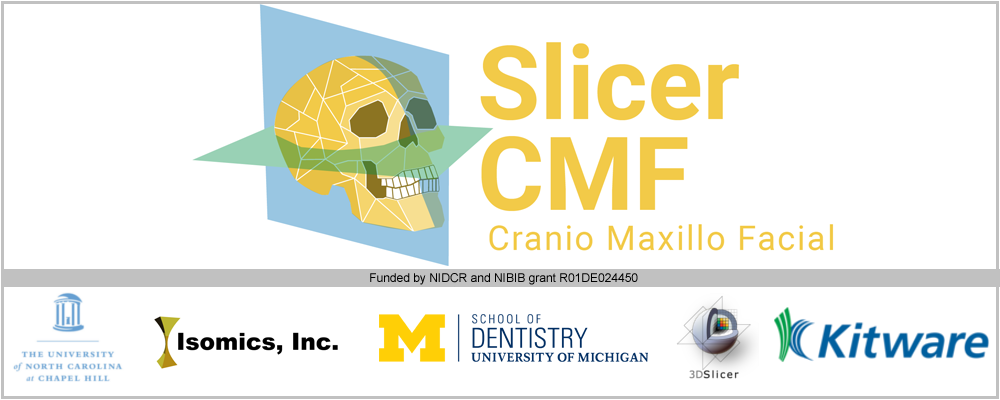
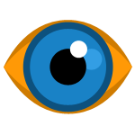
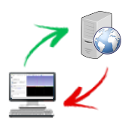
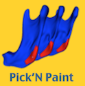
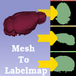

What is SlicerCMF?
------------------

SlicerCMF is an extension of [3D Slicer][slicer], a free, open source software for visualization and image analysis. SlicerCMF can be installed from the 3D Slicer Extension Manager on Windows, Mac, and Linux to leverage the advanced features of 3D Slicer in dental image analysis.

SlicerCMF provides registration, segmentation and quantification modules for dental images analysis that may support patient-specific decision making and assessment in the context of disease progression.

[slicer]: https://slicer.org

Available Modules
-----------------

|[][ShapePopulationViewer] | ``ShapePopulationViewer`` module allows to interact with multiple 3D surfaces at the same time. It supports visualization and comparison of 3D surfaces by displaying the associated pointwise data (scalar or vector maps) via customizable colormaps.|
[][EasyClip] | ``EasyClip`` Module is used to clip and close one or several models according to a predetermined plane. Planes can be saved and reused.|
|[][DatabaseInteractor] | ``DatabaseInteractor`` module contains multiple panels that allow the user to manage data from a web database. The data displayed in this extension dynamically reacts with user local folders and online database. The user should login with the same credentials than on the server entered as input.|
|[][ModelToModelDistance] | ``ModelToModelDistance`` module computes a point by point distance between two models. The distance can be signed or unsigned. The output volume has the same number of points as the first input volume. The distances are saved as in the model as a point data array under the name "Distance" which is added to the input point and cell arrays already in the first input file. |
|[][AnglePlanes] | ``AnglePlanes`` module is used to calculate the angle between two planes. The user selects already loaded planes or they can define a plane by using three landmarks.|
|[][MeshStatistics] | ``MeshStatistics`` module computes descriptive statistics (min, max, avg, std, 5th per, 15th per, 15th per, 75th per, 85th per and 99th per) on data fields of a model or models. The statistics can be computed over predefined regions (selected with Pick and Paint) or the entire model. |
|[][PickAndPaint] | ``PickAndPaint`` module selects a region of interest (ROI) in a model or models. The user selects a landmark and a number of vertices to define the size of the ROI, and this information gets propagated to the rest of the models in case of having multiple ones. |
|[][CMFreg] | ``CMFreg`` module performs region based registration. |
|[][MeshToLabelMap] | ``MeshToLabelMap`` module scan converts a model into a binary segmentation image volume.|
|[][Q3DC] | ``Q3DC`` module allows to perform head measurements used in craniofacial surgery (called Quantitative 3D Cephalometrics). Using placed fiducials, the module allows users to compute 2D angles: Yaw, Pitch and Roll; and decompose the 3D distance into the three different components: R-L , A-P and S-I. It is possible to compute the middle point between two fiducials and export the values.|

[ShapePopulationViewer]: https://www.slicer.org/wiki/Documentation/4.10/Extensions/ShapePopulationViewer
[EasyClip]: https://www.slicer.org/wiki/Documentation/4.10/Extensions/EasyClip
[DatabaseInteractor]: https://www.slicer.org/wiki/Documentation/4.10/Extensions/DatabaseInteractor
[ModelToModelDistance]: https://www.slicer.org/wiki/Documentation/4.10/Extensions/ModelToModelDistance
[AnglePlanes]: https://www.slicer.org/wiki/Documentation/4.10/Extensions/AnglePlanes
[MeshStatistics]: https://www.slicer.org/wiki/Documentation/4.10/Extensions/MeshStatistics
[PickAndPaint]: https://www.slicer.org/wiki/Documentation/4.10/Extensions/PickAndPaint
[CMFreg]: https://www.slicer.org/wiki/Documentation/4.10/Extensions/CMFreg
[MeshToLabelMap]: https://www.slicer.org/wiki/Documentation/4.10/Extensions/MeshToLabelMap
[Q3DC]: https://www.slicer.org/wiki/Documentation/4.10/Extensions/Q3DC
